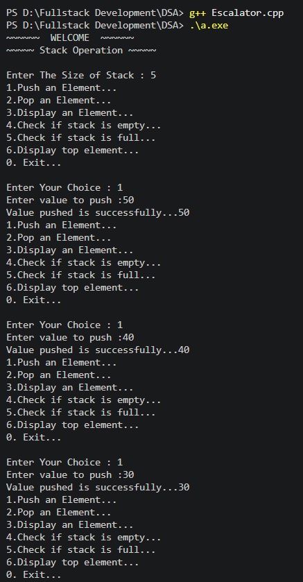
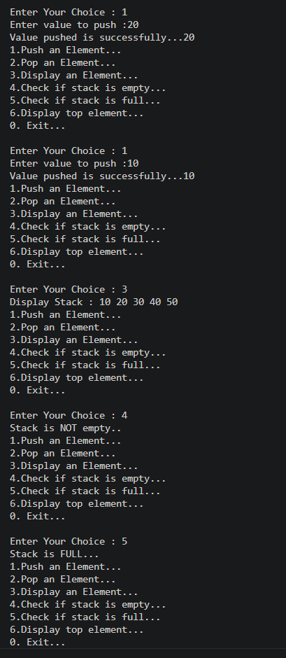
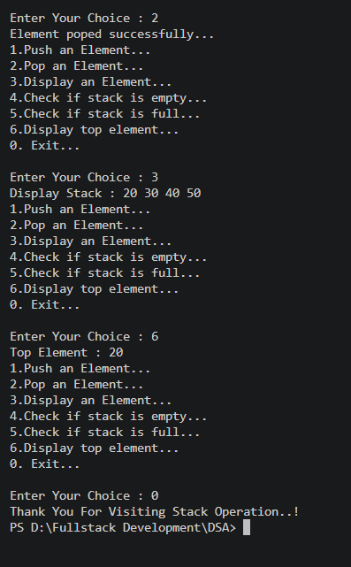

# 📚 PR-4: Stack Implementation (Escalator Concept)

## 📌 Overview

This project demonstrates the implementation of a **Stack Data Structure** using arrays in C++.
A stack follows the **LIFO (Last In First Out)** principle, similar to an escalator where the last person entering exits first.

---

## ⚙️ Features

* Push an element into the stack
* Pop an element from the stack
* Display the top element
* Check if the stack is empty
* Check if the stack is full
* Display all elements in the stack

---

## 🧠 Concepts Used

* Class & Object
* Encapsulation
* Menu-driven programming
* Array implementation of stack

---

## 🛠️ How to Run

1. Open terminal

2. Compile the program:
   g++ Escalator.cpp

3. Run the program:
   ./a.exe

4. Follow menu instructions

---

## 📸 Output Screenshots

---

## 📂 Project Structure

PR-4
│── Escalator.cpp
│── README.md
├── Output-1.png
├── Output-2.png
├── Output-3.png
  

---

## 🎯 Conclusion

This project helped in understanding the working of stack operations like push and pop using arrays in C++. It also demonstrates menu-driven programming for better user interaction.

---
